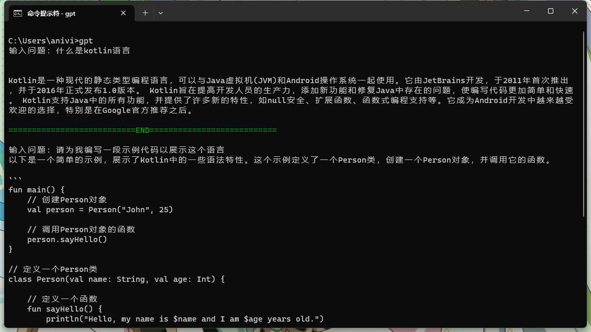

 # For [Chinese](./README.MD) | English user

 - Step to use：
 - make sure you are installed python
   - make sure you are installed all dependencies for this project
    - make sure you are already add your api-key to gpt.bat

Then, right-click in this folder and type gpt, or you can double-click the gpt.bat.

How to install dependencies：
```
pip install openai
pip install colorama
```

Key profile: Add your api-key to the second line of gpt.bat, for example
```
set OPENAI_KEY=sk-************************************************
```

Demo：


 ### Help：
All command will start with _ character, now we have stop, clear, export commands.

| Command | Work                            |
|---------|---------------------------------|
| stop    | exit gpt                        |
| clear   | clear context                   |
| export  | export your dialogue to desktop |

For example：_stop will exit

 ### Note: For save your account quota, please use `_clear` on the end of any topic to clear context, because we need send everything you chat with to tell chatgpt the topic context.

